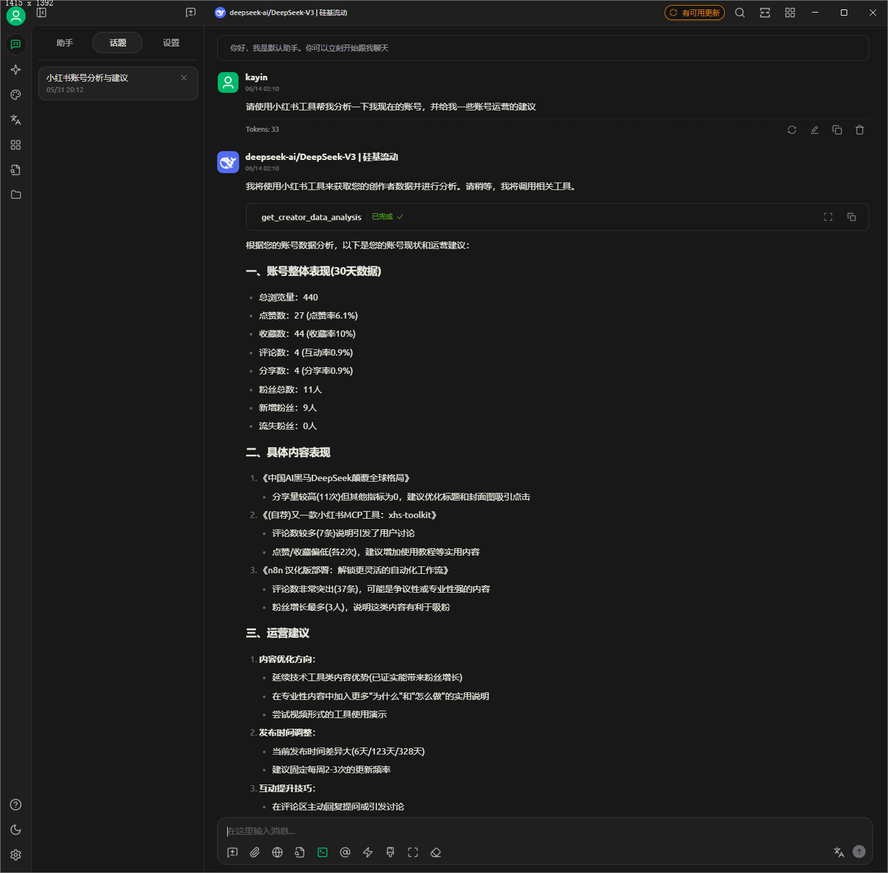

# 📕 小红书MCP工具包

[](LICENSE)
[](src/static/qrcode_for_gh_19088e185f66_258.jpg)

一个强大的小红书自动化工具包，支持通过MCP协议与AI客户端（如Claude Desktop等）集成，实现与AI对话即可进行内容创作、发布及创作者数据分析。

## ✨ 主要特性

- 🍪 **Cookie管理**: 安全获取、验证和管理小红书登录凭证
- 🤖 **MCP协议支持**: 与CherryStudio等AI客户端无缝集成
- 📝 **自动发布**: 支持图文和视频笔记的自动化发布
- ⏰ **定时任务**: 支持cron表达式的定时数据采集
- 📊 **数据采集**: 自动采集创作者中心仪表板、内容分析、粉丝数据
- 🧠 **AI数据分析**: 中文表头数据，AI可直接理解和分析
- 💾 **数据存储**: 支持csv本地存储（sql目前保留，暂不开发）
- 🎯 **统一接口**: 一个工具解决llm操作小红书自动化需求

## 📋 功能清单

### 内容发布
- [x] **图文发布** - 支持发布图文笔记
- [x] **视频发布** - 支持发布视频笔记 
- [ ] **内容搜索** - 支持指定搜索（开发计划中）

### 数据采集 🆕
- [x] **仪表板数据** - 采集账号概览数据（粉丝数、获赞数等）
- [x] **内容分析数据** - 采集笔记表现数据（浏览量、点赞数等）
- [x] **粉丝数据** - 采集粉丝增长和分析数据
- [x] **定时采集** - 支持cron表达式的自动定时采集
- [x] **数据存储** - CSV本地存储（默认）

## 📋 环境要求

- **浏览器**: Google Chrome 浏览器
- **驱动**: ChromeDriver (`brew install chromedriver`)

## 🚀 快速开始

### 一键安装（推荐）

```bash
# 下载并运行安装脚本
curl -sSL https://raw.githubusercontent.com/aki66938/xiaohongshu-mcp-toolkit/main/install.sh | bash

# 或者手动运行
git clone https://github.com/aki66938/xiaohongshu-mcp-toolkit.git
cd xiaohongshu-mcp-toolkit
bash install.sh
```

### 下载使用

1. 从 [Releases页面](https://github.com/aki66938/xhs-toolkit/releases/latest) 下载适合你操作系统的版本
2. 解压并运行：
   ```bash
   # macOS/Linux
   chmod +x xhs-toolkit
   ./xhs-toolkit status
   
   # Windows
   xhs-toolkit.exe status
   ```

### 从源码运行

```bash
git clone https://github.com/aki66938/xiaohongshu-mcp-toolkit.git
cd xiaohongshu-mcp-toolkit
pip install -r requirements.txt
python xhs_toolkit.py status
```


## 🛠️ 使用指南

### 1. 创建配置文件

复制并编辑配置文件：

```bash
cp env_example .env
vim .env  # 编辑配置
```

**必需配置**：
```bash
# Chrome浏览器路径
CHROME_PATH="/Applications/Google Chrome.app/Contents/MacOS/Google Chrome"

# ChromeDriver路径  
WEBDRIVER_CHROME_DRIVER="/opt/homebrew/bin/chromedriver"

# Cookies存储路径
json_path="./xhs/cookies"
```

### 2. 获取登录凭证

```bash
./xhs-toolkit cookie save
```


在弹出的浏览器中：
1. 登录小红书创作者中心
2. 确保能正常访问创作者中心功能
3. 建议点击进入【发布笔记】页面，确认权限完整
4. 完成后按回车键保存

### 3. 启动MCP服务器

```bash
./xhs-toolkit server start
```

### 4. 客户端配置
**Claude Desktop**

在 `~/.claude_desktop_config.json` 中添加：

```json
{
  "mcpServers": {
    "xiaohongshu": {
      "command": "curl",
      "args": [
        "-N",
        "-H", "Accept: text/event-stream",
        "http://localhost:8000/sse"
      ]
    }
  }
}
```

**cherry studio**

在MCP配置中添加


**n8n**

在n8n的AI agent节点的tool中添加配置配置


## 🔧 主要功能

### MCP工具列表

| 工具名称 | 功能说明 | 参数 | 备注 |
|---------|----------|------|------|
| `test_connection` | 测试连接 | 无 | |
| `start_publish_task` | 启动异步发布任务 ⚡ | title, content, tags, images, videos |  |
| `check_task_status` | 检查任务状态 | task_id | 配合异步任务使用 |
| `get_task_result` | 获取任务结果 | task_id | 获取最终发布结果 |
| `close_browser` | 关闭浏览器 | 无 | 释放资源 |
| `test_publish_params` | 测试发布参数 | title, content, tags, images, videos | 参数验证 |
| `get_creator_data_analysis` | 获取创作者数据分析 | 无 | AI数据分析专用 |

### 📱 异步发布模式 ⚡

解决Cherry Studio等MCP客户端的超时问题：

**使用方法**：
1. **启动任务**：`start_publish_task("标题", "内容", videos="视频路径")`
2. **检查进度**：`check_task_status("任务ID")`
3. **获取结果**：`get_task_result("任务ID")`


### 快速发布

```bash
# 图文发布
python xhs_toolkit.py publish "今日分享" "内容文本" --tags "生活,美食" --images "/path/to/image1.jpg,/path/to/image2.jpg"

# 视频发布 🆕
python xhs_toolkit.py publish "视频分享" "视频内容描述" --tags "生活,vlog" --videos "/path/to/video.mp4"

# 命令行发布
./xhs-toolkit publish "今日分享" "内容文本" --tags "生活,美食" --images "/path/to/image1.jpg"

# 通过Claude发布（推荐）
# 图文：请发布一篇小红书笔记，标题："今日分享"，内容："..."，图片路径："/User/me/xhs/poster.png"
# 视频：请发布一篇小红书视频，标题："今日vlog"，内容："..."，视频路径："/User/me/xhs/video.mp4"
```

发布原理：
手工上传过程中，浏览器会弹窗让用户选中文件路径
告诉ai路径位置，ai会把路径参数对应丢给mcp的参数中，完成上传动作

**智能等待机制** ：
- **图片上传**：快速上传，无需等待
- **视频上传**：轮询检测上传进度，等待"上传成功"标识出现
- **超时保护**：最长等待2分钟，避免MCP调用超时 
- **状态监控**：DEBUG模式显示视频文件大小和时长信息
- **高效轮询**：每2秒检查一次，精确文本匹配 

### 📊 数据采集与AI分析功能 🆕(v1.2.0)

自动采集小红书创作者数据，支持定时任务和AI智能分析。

#### 🧠 AI数据分析特性
- **中文表头**: CSV文件使用中文表头，AI可直接理解数据含义
- **智能分析**: 通过 `get_creator_data_analysis` MCP工具获取完整数据
- **数据驱动**: AI基于真实数据提供内容优化建议
- **趋势分析**: 分析账号表现趋势和粉丝增长情况

#### 环境变量配置

在`.env`文件中添加数据采集相关配置：

```bash
# ==================== 数据存储配置 ====================
# 是否启用PostgreSQL数据库存储（false=仅使用CSV存储，true=同时使用PostgreSQL）
ENABLE_DATABASE=false

# CSV数据存储路径（本地存储始终启用）
DATA_STORAGE_PATH=data

# ==================== 定时任务配置 ====================
# 是否启用自动数据采集
ENABLE_AUTO_COLLECTION=true

# 程序启动时是否立即执行一次数据采集
RUN_ON_STARTUP=true

# 定时采集计划（cron表达式格式：分 时 日 月 星期）
# 默认：每天凌晨1点执行数据采集
COLLECTION_SCHEDULE=0 1 * * *

# 采集任务配置
COLLECT_DASHBOARD=true          # 是否采集仪表板数据
COLLECT_CONTENT_ANALYSIS=true   # 是否采集内容分析数据  
COLLECT_FANS=true               # 是否采集粉丝数据
```

#### 使用示例

```bash
# 运行数据采集示例
python examples/data_collection_example.py

# 仅手动采集
python examples/data_collection_example.py --mode manual

# 启用调度器演示
python examples/data_collection_example.py --mode scheduler

# 启用数据库存储
python examples/data_collection_example.py --enable-db
```

#### 采集的数据类型

1. **仪表板数据**: 粉丝数、获赞数、浏览量等账号概览数据
2. **内容分析数据**: 笔记表现数据，包括浏览量、点赞数、评论数等
3. **粉丝数据**: 粉丝增长趋势、粉丝画像分析等

#### 🤖 AI使用示例

```bash
# 通过Claude Desktop或其他chat客户端
"请分析我的小红书账号数据，给出内容优化建议"

# AI将自动调用 get_creator_data_analysis 工具
# 获取中文表头的数据并进行智能分析
```

#### 定时任务示例

```bash
# 每6小时采集一次
COLLECTION_SCHEDULE=0 */6 * * *

# 工作日上午9点采集
COLLECTION_SCHEDULE=0 9 * * 1-5

# 每月1号凌晨2点采集
COLLECTION_SCHEDULE=0 2 1 * *
```

采用cron语法

### 版本演示截图(V1.2.0)




## 🛠️ 常用命令

```bash
# 检查状态
./xhs-toolkit status

# Cookie管理
./xhs-toolkit cookie save      # 获取cookies
./xhs-toolkit cookie validate  # 验证cookies

# 服务器管理
./xhs-toolkit server start     # 启动服务器
./xhs-toolkit server start --port 8080  # 自定义端口
./xhs-toolkit server stop      # 停止服务器
./xhs-toolkit server status    # 检查服务器状态
```
## 🔐 安全承诺

- ✅ **本地存储**: 所有数据仅保存在本地
- ✅ **开源透明**: 代码完全开源，可审计
- ✅ **用户控制**: 您完全控制自己的数据


## Future

**作者的一些话**

搬家的事要放到7月了。。。。
所以近期更新了新内容，关于创作者中心数据的采集并交付给AI进行分析

后续更新打算以小版本迭代为主，目前功能开发进度比较快，有很多可以优化待优化的操作逻辑需要调整，比如最影响的两点是cookies，让ai来自动打开网页让用户进行登录（一般情况），还有无头模式下如何实现用户输验证码等等，操作逻辑的优化能改善不少体验，因此短期内是暂时不会在架构和功能上进行大的改动了。

再往后可能会考虑用playwright进行重构，以及www首页采集热点文章等等。热点文章采集也仅仅用于AI分析，供创作者学习，洗稿一类的操作，平台应该是禁止的，所以这方面的功能是不会开发的。

文档将在微信公众号上更新，欢迎大家关注点击文档顶部的胶囊按钮扫码关注我的公众号，你的支持是我继续开发完善工具的动力！

## 📄 许可证

本项目基于 [MIT许可证](LICENSE) 开源。

---

<div align="center">
Made with ❤️ for content creators
</div> 
