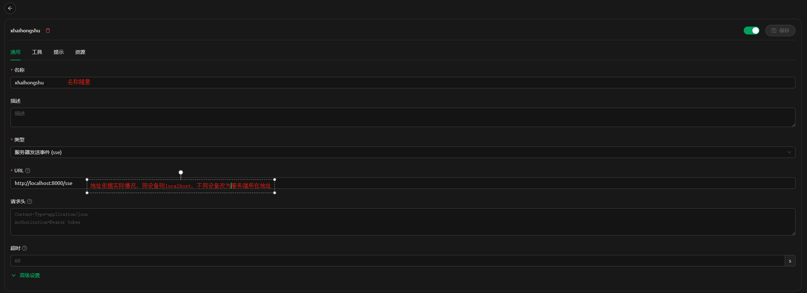
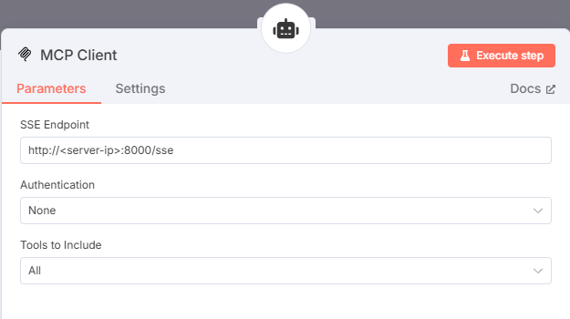

# 📕 小红书MCP工具包

[](LICENSE)
[](src/static/qrcode_for_gh_19088e185f66_258.jpg)

一个强大的小红书自动化工具包，支持通过MCP协议与AI客户端（如Claude Desktop等）集成，实现与AI对话即可进行内容创作、发布及创作者数据分析。

## ✨ 主要特性

- 🍪 **Cookie管理**: 安全获取、验证和管理小红书登录凭证
- 🤖 **MCP协议支持**: 与CherryStudio等AI客户端无缝集成
- 📝 **自动发布**: 支持图文和视频笔记的自动化发布
- ⏰ **定时任务**: 支持cron表达式的定时数据采集
- 📊 **数据采集**: 自动采集创作者中心仪表板、内容分析、粉丝数据
- 🧠 **AI数据分析**: 中文表头数据，AI可直接理解和分析
- 💾 **数据存储**: 支持csv本地存储（sql目前保留，暂不开发）
- 🎯 **统一接口**: 一个工具解决llm操作小红书自动化需求

## 📋 功能清单

### 内容发布
- [x] **图文发布** - 支持发布图文笔记
- [x] **视频发布** - 支持发布视频笔记 
- [ ] **内容搜索** - 支持指定搜索（开发计划中）

### 数据采集 🆕
- [x] **仪表板数据** - 采集账号概览数据（粉丝数、获赞数等）
- [x] **内容分析数据** - 采集笔记表现数据（浏览量、点赞数等）
- [x] **粉丝数据** - 采集粉丝增长和分析数据
- [x] **定时采集** - 支持cron表达式的自动定时采集
- [x] **数据存储** - CSV本地存储（默认）

## 📋 环境要求

### 🌐 浏览器环境
- **Google Chrome 浏览器** (最新版本推荐)
- **ChromeDriver** (版本必须与Chrome版本完全匹配)

### 🔍 查看Chrome版本
在Chrome浏览器中访问：`chrome://version/`


### 📥 ChromeDriver安装方式

#### 方法一：自动下载（推荐）
```bash
# 使用webdriver-manager自动管理
pip install webdriver-manager
```

#### 方法二：手动下载
1. 📋 访问官方下载页面：[Chrome for Testing](https://googlechromelabs.github.io/chrome-for-testing/)
2. 🎯 选择与您Chrome版本完全匹配的ChromeDriver
3. 📁 下载后解压到合适位置（如 `/usr/local/bin/` 或 `C:\tools\`）
4. ⚙️ 在 `.env` 文件中配置正确路径

#### 方法三：包管理器安装
```bash
# macOS (Homebrew)
brew install --cask chromedriver

# Windows (Chocolatey)  
choco install chromedriver

# Linux (Ubuntu/Debian)
sudo apt-get install chromium-chromedriver
```

> ⚠️ **重要提示**：版本不匹配是最常见的问题原因，请确保ChromeDriver版本与Chrome浏览器版本完全一致！

## 🚀 快速开始

### 一键安装（推荐）

```bash
# 下载并运行安装脚本
curl -sSL https://raw.githubusercontent.com/aki66938/xhs-toolkit/main/install.sh | bash

# 或者手动运行
git clone https://github.com/aki66938/xhs-toolkit.git
cd xhs-toolkit
bash install.sh
```


### 🛠️ 从源码运行

#### 方法一：uv (推荐 ⚡)

```bash
# 克隆项目
git clone https://github.com/aki66938/xhs-toolkit.git
cd xhs-toolkit

# 使用uv安装依赖并运行
uv sync
uv run python xhs_toolkit.py status
```

> 💡 **uv使用提示**：文档中所有 `python` 命令都可以用 `uv run python` 替代，享受更快的依赖管理体验！

#### 方法二：pip (传统方式)

```bash
# 克隆项目
git clone https://github.com/aki66938/xhs-toolkit.git
cd xhs-toolkit

# 创建虚拟环境（推荐）
python -m venv venv
source venv/bin/activate  # Windows: venv\Scripts\activate

# 安装依赖
pip install -r requirements.txt
python xhs_toolkit.py status
```


## 🛠️ 使用指南

### 1. 创建配置文件

复制并编辑配置文件：

```bash
cp env_example .env
vim .env  # 编辑配置
```

**必需配置**：
```bash
# Chrome浏览器路径
CHROME_PATH="/Applications/Google Chrome.app/Contents/MacOS/Google Chrome"

# ChromeDriver路径  
WEBDRIVER_CHROME_DRIVER="/opt/homebrew/bin/chromedriver"
```

### 2. 获取登录凭证

```bash
python xhs_toolkit.py cookie save
```


在弹出的浏览器中：
1. 登录小红书创作者中心
2. 确保能正常访问创作者中心功能
3. 完成后按回车键保存

### 3. 启动MCP服务器

```bash

python xhs_toolkit.py server start
```

### 4. 客户端配置
**Claude Desktop**

在 `~/.claude_desktop_config.json` 中添加：

```json
{
  "mcpServers": {
    "xiaohongshu": {
      "command": "curl",
      "args": [
        "-N",
        "-H", "Accept: text/event-stream",
        "http://localhost:8000/sse"
      ]
    }
  }
}
```

**cherry studio**

在MCP配置中添加




**n8n**

在n8n的AI agent节点的tool中添加配置配置




## 🔧 主要功能

### MCP工具列表

| 工具名称 | 功能说明 | 参数 | 备注 |
|---------|----------|------|------|
| `test_connection` | 测试MCP连接 | 无 | 连接状态检查 |
| `smart_publish_note` | 发布小红书笔记 ⚡ | title, content, images, videos, tags, location | 支持智能路径解析 |
| `check_task_status` | 检查发布任务状态 | task_id | 查看任务进度 |
| `get_task_result` | 获取已完成任务的结果 | task_id | 获取最终发布结果 |
| `login_xiaohongshu` | 智能登录小红书 | force_relogin, quick_mode | MCP专用无交互登录 |
| `get_creator_data_analysis` | 获取创作者数据用于分析 | 无 | AI数据分析专用 |


### 💬 AI对话式操作指南

通过与AI对话即可完成登录、发布、数据分析等操作，无需学习复杂命令。

#### 🔐 智能登录
```
用户："登录小红书"
```

**重要提示**：
- 🚨 首次使用请不要更改`headless`参数，获取到cookies后再更改为无头模式
- 🌐 AI调用登录工具后会拉起浏览器，首次登录需要手动输入验证码或扫码
- 🍪 成功后会自动保存cookies到本地，下次就免登录了

#### 📝 内容发布

**图文发布**：
```
请发布一篇小红书笔记，标题："今日分享"，内容："..."，图片路径："/User/me/xhs/poster.png"
```

**视频发布**：
```
请发布一篇小红书视频，标题："今日vlog"，内容："..."，视频路径："/User/me/xhs/video.mp4"
```

#### 📊 数据分析
```
请分析我的小红书账号数据，给出内容优化建议
```

#### 🔧 发布原理

手工上传过程中，浏览器会弹窗让用户选中文件路径，AI会将用户提供的路径参数传递给MCP工具，自动完成上传动作。

#### ⚡ 智能等待机制

- **📷 图片上传**：快速上传，无需等待
- **🎬 视频上传**：轮询检测上传进度，等待"上传成功"标识出现
- **⏱️ 超时保护**：最长等待2分钟，避免MCP调用超时 
- **📊 状态监控**：DEBUG模式显示视频文件大小和时长信息
- **🔄 高效轮询**：每2秒检查一次，精确文本匹配 

### 📊 数据采集与AI分析功能 🆕(v1.2.0)

自动采集小红书创作者数据，支持定时任务和AI智能分析。

#### 🧠 AI数据分析特性
- **中文表头**: CSV文件使用中文表头，AI可直接理解数据含义
- **智能分析**: 通过 `get_creator_data_analysis` MCP工具获取完整数据
- **数据驱动**: AI基于真实数据提供内容优化建议
- **趋势分析**: 分析账号表现趋势和粉丝增长情况


#### 采集的数据类型

1. **仪表板数据**: 粉丝数、获赞数、浏览量等账号概览数据
2. **内容分析数据**: 笔记表现数据，包括浏览量、点赞数、评论数等
3. **粉丝数据**: 粉丝增长趋势、粉丝画像分析等


#### 定时任务示例

采用cron语法，写入配置文件.env
```bash
# 每6小时采集一次
COLLECTION_SCHEDULE=0 */6 * * *

# 工作日上午9点采集
COLLECTION_SCHEDULE=0 9 * * 1-5

# 每月1号凌晨2点采集
COLLECTION_SCHEDULE=0 2 1 * *
```

---

## 🚀 更新日志 - v1.2.2

### 🆕 新增功能

#### 🔐 智能登录系统
- 新增自动化登录检测机制，支持MCP模式下的无交互登录
- 实现四重检测机制：URL状态、页面元素、身份验证、错误状态检测
- 添加智能等待机制，自动监测登录完成状态
- 优化cookies保存逻辑，区分交互模式和自动化模式

#### 🧠 智能路径解析系统
- 新增智能文件路径识别功能，支持多种输入格式自动解析
- 新增 `smart_parse_file_paths()` 函数，使用JSON解析、ast.literal_eval等多种解析方式
- 适配LLM对话场景和dify等平台的数组数据传递

**支持的输入格式**：
- 逗号分隔：`"a.jpg,b.jpg,c.jpg"`
- 数组字符串：`"[a.jpg,b.jpg,c.jpg]"`
- JSON数组：`'["a.jpg","b.jpg","c.jpg"]'`
- 真实数组：`["a.jpg", "b.jpg", "c.jpg"]`
- 混合格式：`"[a.jpg,'b.jpg',\"c.jpg\"]"`

#### 🛠️ 代码架构优化
- 重构登录相关模块，提升代码可维护性
- 优化异常处理机制，增强系统稳定性

### 🔧 修复功能

#### 📝 路径处理优化
- 解决用户反馈的多张图片上传格式识别问题
- 智能区分字符串和数组格式，避免数据类型判断错误
- 支持从不同平台（dify、LLM对话等）传递的各种数据格式
- 增强容错能力，即使格式不标准也能尽量解析

---

## 🚀 开发路线图

### 📋 待开发功能

#### 🔥 高优先级
- **🌐 网络图片支持** - 图文发布将支持网络路径的图片，当前仅支持本地路径
- **🏷️ 标签功能** - 目前tag标签暂未可用，tag是小红书内容发布增加流量的重要手段，必须支持

#### 📈 中优先级
- **🔐 登录体验优化** - 支持无头模式下在控制台展示二维码或手动输入验证码

#### 🔮 规划中
- **🤖 AI创作声明** - 如果内容是AI生成，AI创作声明配置功能


## 🔧 故障排除

### ChromeDriver常见问题

#### ❌ 问题：版本不匹配错误
```
selenium.common.exceptions.SessionNotCreatedException: session not created: This version of ChromeDriver only supports Chrome version XX
```

**✅ 解决方案**：
1. 🔍 检查Chrome版本：访问 `chrome://version/`
2. 📥 下载对应版本的ChromeDriver：[Chrome for Testing](https://googlechromelabs.github.io/chrome-for-testing/)
3. ⚙️ 更新 `.env` 文件中的路径配置

#### ❌ 问题：ChromeDriver找不到
```
selenium.common.exceptions.WebDriverException: 'chromedriver' executable needs to be in PATH
```

**✅ 解决方案**：
1. 确认ChromeDriver已下载并解压
2. 方案A：将ChromeDriver添加到系统PATH
3. 方案B：在 `.env` 中配置完整路径：`WEBDRIVER_CHROME_DRIVER="/path/to/chromedriver"`
4. Linux/macOS: 确保文件有执行权限 `chmod +x chromedriver`

#### ❌ 问题：Chrome浏览器路径错误
```
selenium.common.exceptions.WebDriverException: unknown error: cannot find Chrome binary
```

**✅ 解决方案**：在 `.env` 文件中配置正确的Chrome路径
```bash
# macOS
CHROME_PATH="/Applications/Google Chrome.app/Contents/MacOS/Google Chrome"

# Windows
CHROME_PATH="C:\Program Files\Google\Chrome\Application\chrome.exe"

# Linux
CHROME_PATH="/usr/bin/google-chrome"
```

### 其他常见问题

#### ❌ 问题：MCP连接失败
**✅ 解决方案**：
1. 确认服务器已启动：`python xhs_toolkit.py server start`
2. 检查端口8000是否被占用
3. 重启Claude Desktop或其他MCP客户端

#### ❌ 问题：登录失败
**✅ 解决方案**：
1. 清除旧的cookies：删除 `xhs_cookies.json` 文件
2. 重新获取cookies：`python xhs_toolkit.py cookie save`
3. 确保使用正确的小红书创作者中心账号

---

## 🙏 鸣谢

感谢以下贡献者为项目的发展做出的贡献：

- **[@leebuooooo](https://github.com/leebuooooo)** (郭立ee) - 贡献了uv启动方式，提升了项目的依赖管理和运行体验

如果您也想为项目做出贡献，欢迎提交 Pull Request 或 Issue！

## 📄 许可证

本项目基于 [MIT许可证](LICENSE) 开源。

## 🔐 安全承诺

- ✅ **本地存储**: 所有数据仅保存在本地
- ✅ **开源透明**: 代码完全开源，可审计
- ✅ **用户控制**: 您完全控制自己的数据


<div align="center">
Made with ❤️ for content creators
</div> 
